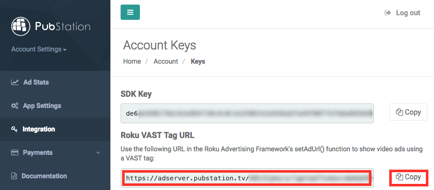

PubStation Roku TV integration using a VAST tag
============================================

Thank you for your interest in using PubStation video advertising in your cool new Roku channel!

You are lucky, because showing PubStation video ads on Roku is **very easy** - thanks to the Roku Advertising Framework (RAF)
and the already for you prepared VAST tag that you just have to copy & paste.

If you didn't sign up for a PubStation account yet, visit our website at http://pubstation.tv.

Integration
-----------

The first step to show PubStation video ads in your app is to integrate the RAF in your channel. If you haven't done that yet,
please have a look at the official documentation of the RAF: https://sdkdocs.roku.com/display/sdkdoc/Roku+Advertising+Framework.
There, you should find everything which is necessary for integrating the RAF.

Afterwards, login into your PubStation dashboard. Click on the menu point "Integration".



Copy the Roku VAST Tag URL using the "Copy" button on the right. Just use this URL in the


```brightscript
setAdUrl("YOUR_PUBSTATION_VAST_URL")
```

call when setting up the RAF - **and you are done**! Showing video ads should just work now straight away using the

```brightscript
showAds(...)
```

method of the RAF! :)

If not or if you have any further questions, do not hesitate to get in touch with us!
